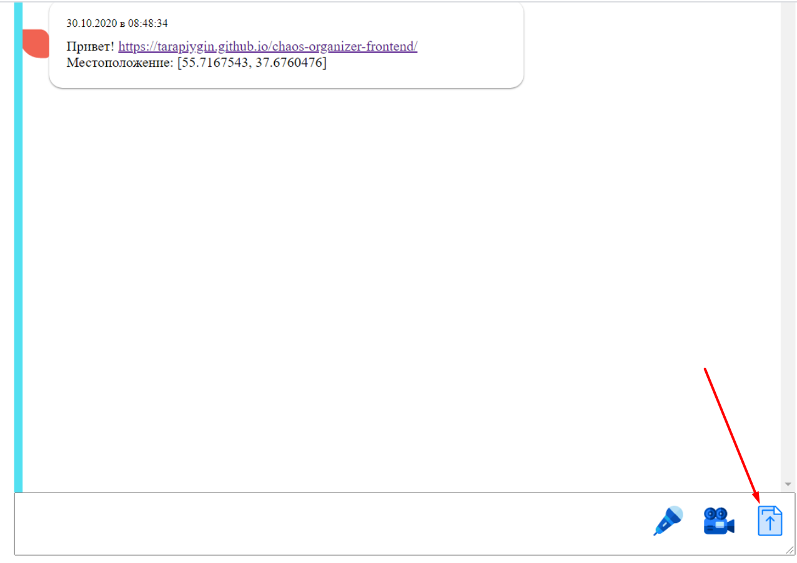
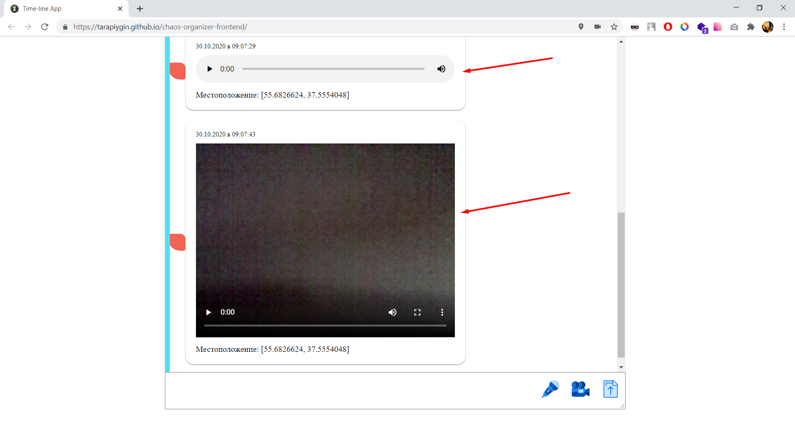
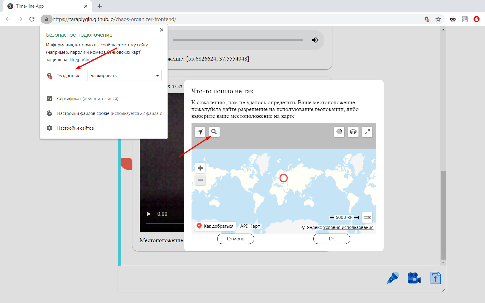

# Chaos organizer frontend

- exapmle: <a href="https://tarapiygin.github.io/chaos-organizer-frontend/">Github Pages</a>
- frontend: <a href="https://github.com/tarapiygin/chaos-organizer-frontend">Repo</a>
- backend: <a href="https://github.com/tarapiygin/chaos-organizer-backend/">Repo</a>

## Функции:
1. Сохранение в истории ссылок и текстовых сообщений

2. Ссылки (то, что начинается с http:// или https://) должны быть кликабельны и отображаться как ссылки

3. Сохранение в истории изображений, видео и аудио (как файлов) - через Drag & Drop и через иконку загрузки (скрепка в большинстве мессенджеров)

4. Скачивание файлов (на компьютер пользователя)

5. Ленивая подгрузка: сначала подгружаются последние 10 сообщений, при прокрутке вверх подгружаются следующие 10 и т.д.

6. Синхронизация - если приложение открыто в нескольких окнах (вкладках), то контент должен быть синхронизирован

7. Запись видео и аудио (используя API браузера)

8. Воспроизведение видео/аудио (используя API браузера)

9. Работа в оффлайн-режиме (при это загруженные сообщения должны кэшироваться и быть доступными после обновления страницы)

10. Отправка геолокации

11. Получение геолокации через API яндекс карт
